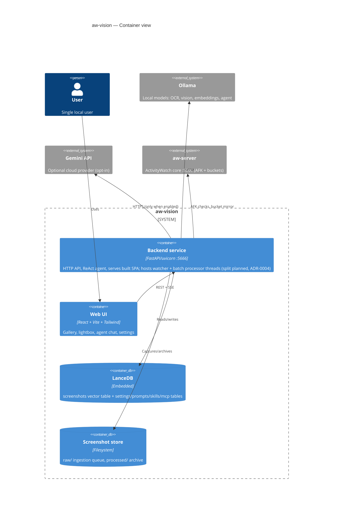

# Agent Operational & Onboarding Guide (AGENTS.md)

Welcome, AI Agent! This document defines the operational boundaries, design patterns, testing strategies, and collaborative conventions for the `aw-vision` repository.

As an agentic AI coder or human contributor, you must adhere strictly to these principles to maintain codebase sanity and ensure future AI and human developers can read, modify, and build upon your work efficiently.

---

## 1. Product Context & Core Business Value

The **`aw-vision`** system is an advanced, local-first visual and semantic indexing extension for **ActivityWatch**. It acts as an autonomous semantic memory engine, capturing desktop views, extracting layout texts, and enabling natural language query retrieval over the user's historical computer sessions.

### Key Workflows & Data Pipelines:
* **AFK-Aware Ingestion Loop**: The system monitors the user's active/idle status via `aw-server`'s AFK bucket. Screens are only captured when the user is active, protecting resource utilization and preventing redundant disk writes during AFK cycles.
* **Provider-Switchable Bulk Processor Pipeline**: Screenshots are batched and processed in moments of low system activity (CPU-aware bulk execution). The active provider (local **Ollama** or cloud **Gemini**) and all model names are configured at runtime in **Settings** (persisted in LanceDB via `settings.py`), not hardcoded. The pipeline executes three staged sweeps per batch:
  1. **Phase 1 — OCR Extraction**: Local Ollama OCR model (default `glm-ocr:q8_0`) or cloud Gemini OCR pulls exact text lines from the screen.
  2. **Phase 2 — Vision Analysis & Classification**: Either a single combined multimodal Gemini call, or a two-pass local flow (vision pass → text-only synthesis pass). Both paths are grounded in previously processed snapshots (temporal neighbors, historically similar labeled snapshots, per-app project statistics — assembled by `processor/history_context.py`) to keep classification and terminology consistent over time. Produces the foreground/peripheral descriptions, unique artifacts, technical tags, an evidence-based `project_reasoning` trace, the project classification, and the dense "caveman" description.
  3. **Phase 3 — Embedding & Commit**: Generates the semantic vector (local `embeddinggemma` or multimodal Gemini embeddings; dimension probed dynamically) over the joint metadata/description/OCR/user-note text and commits everything to local LanceDB.
* **User-Steerable Analysis**: Every prompt in the pipeline is a user-editable template (**Settings → Prompts**, `prompts.py`) rendered with safe single-brace placeholder substitution. Users can attach **MCP servers** (`mcp_manager.py`) and **Claude Skills** (`skills.py`) to individual prompt slots (`local_vision`, `local_synthesis`, `gemini_combined`, `agent`) to inject external tool context or expert instructions. Each snapshot also carries an optional free-text **user context note** (`user_context`) that is treated as authoritative evidence during (re)processing.
* **Storage Retention Lifecycle**: To avoid infinite disk growth, a background daemon scans LanceDB hourly and unlinks raw/processed `.png` files older than 14 days (`max_screenshot_lifetime_days`). Crucially, **the database records, descriptions, OCR texts, reasoning traces, and semantic coordinates are kept forever**, ensuring historical activity remains queryable even after physical images are purged.

---

## 2. Work Tracking, Git & PR Habits

### Project Key Work Tracking:
* All work is tracked and organized around specific client project IDs listed in `projects.json`.
* **Standard Project Keys**: Standard keys follow the format **`PRJ-YYYY-XXX`** (e.g., `PRJ-2026-042` or `PRJ-2026-089`).
* **Rule**: Before writing code, ensure your active development branch is named using the project key in uppercase as a prefix, followed by lowercase description tokens:
  ```bash
  PRJ-2026-042_setup_linting_and_precommit
  ```

### Git Commit Standards:
* **Bracketed Project Prefix**: Every git commit title and Pull Request title **MUST** start with the bracketed project identifier matching the work:
  ```text
  [PRJ-2026-042] Integrate python code linters and pre-commit hooks
  ```
* **No Conventional Tags**: Do **NOT** use conventional/semantic commit prefix tags (such as `feat:`, `fix:`, `chore:`, `refactor:`) in commit or PR titles.
* **Commit Description**: Write clear commit messages detailing the *why* (the problem/rationale) and the *how* (the implementation strategy).

### Pull Request & Review Flow:
* **Branch Isolation**: **Never** commit directly to `master`, `main`, or `stable` branches. Create separate topic branches.
* **Draft PR Policy**: AI Agents **MUST** open all Pull Requests in **DRAFT** state on GitHub.
* **Closed-Loop CI Checks**: Actively monitor the automated status checks on your branch. If any linter, formatter, or test check fails, push immediate corrective fixes.
* **Visual Evidence Mandate**: If your changes impact the user interface (e.g., the Vision tab UI in `aw-webui`), you **must** attach visual evidence (screenshots or screen recordings) to the PR description on GitHub demonstrating the validated flows. Do **NOT** commit screenshot files into the Git repository.
* **Human-Only Merge**: Merging is strictly restricted to human developers. AI Agents must never attempt to merge their own pull requests.
* **Empty Initiator Checklist**: Every PR description must end with an empty checklist for the human dev who initiated the agent, which they must check off to confirm they have personally reviewed the code before switching the PR out of Draft state.

---

## 3. Directory Organization & Python Architecture

The `aw-vision` repository is organized into a clean, lightweight Python package managed by **Poetry**:

```text
aw-vision/
│
├── .flake8                  # Python linting configuration
├── .pre-commit-config.yaml  # Git pre-commit hooks configuration
├── .talismanrc              # Talisman secret-scanner false-positive checksums
├── pyproject.toml           # Poetry dependencies and group settings
├── config.toml              # User configurations (retention, models, etc.)
├── projects.json            # Configured active projects definitions
│
├── aw_vision/               # Core source package
│   ├── config.py            # Configuration loader and parser
│   ├── settings.py          # Runtime settings store (LanceDB-persisted, encrypted keys)
│   ├── watcher.py           # AFK-aware desktop screenshot capture loop
│   ├── embedding.py         # Provider-agnostic embedding text builder & vector generation
│   ├── prompts.py           # Editable pipeline prompt templates (PromptStore + defaults)
│   ├── skills.py            # Claude Skills upload, storage & prompt-slot injection
│   ├── mcp_manager.py       # MCP server configs, tool discovery & slot routing
│   ├── customization_api.py # APIRouter for prompt/skill endpoints
│   ├── server.py            # FastAPI web server and backend API (port 5666)
│   ├── agent.py             # LangGraph ReAct agent & tools registry
│   ├── db/                  # LanceDB package: schema, screenshots, projects,
│   │                        #   analytics, re-embedding migrations
│   ├── gemini/              # Gemini cloud client: http, vision, chat, embeddings
│   └── processor/           # BulkProcessor mixins: monitor, ocr, mirror,
│                            #   vision_sweep, batch, retention, text
│
├── frontend/                # React + TypeScript + Vite + Tailwind web UI
│   └── src/components/      # GalleryTab, LightboxModal, SettingsTab, McpSettings,
│                            #   PromptSettings, SkillSettings, AgentTab, ...
├── deploy/                  # systemd user service unit files
└── tests/                   # Automated unit and integration tests
```

### Architecture at a Glance (C4 Containers):



### Architecture Decision Records:
Long-lived decisions live in `docs/adr/` (one page each; see `0000-template.md`). Before re-designing something fundamental (datastore, tool protocol, process topology, encryption), **read the matching ADR first** — and when you make such a decision, add or supersede an ADR in the same PR. Never re-litigate an Accepted ADR silently.

### Module Responsibilities:
1. **`config.py`**: Reads and structures parameters from `config.toml` (or env variables) such as Ollama hosts, model configurations, and storage directories.
2. **`settings.py`**: Runtime-tunable settings (provider, models, intervals) persisted in LanceDB; sensitive values are AES-256 encrypted with a hardware-derived key.
3. **`db/`**: Defines Arrow table schemas (including `user_context` and `analysis_reasoning` columns), handles database writes/retrievals, globally sorted history queries, schema migrations, and re-embedding runs.
4. **`watcher.py`**: Periodically queries `aw-server`'s AFK state. If active, triggers screen-grabbing CLI utilities (like `grim` or `spectacle`) and saves raw images.
5. **`processor/`**: Gathers raw images, runs CPU-aware checks, and executes the three-phase OCR → vision/classification → embed/commit sweeps plus the hourly retention purge.
6. **`prompts.py` / `skills.py` / `mcp_manager.py`**: The customization layer — editable prompt templates, uploaded Claude Skills, and MCP servers, each assignable to individual pipeline/agent prompt slots.
7. **`server.py` + `customization_api.py`**: FastAPI gateway on port `5666`. Exposes history streams, status checks, Q&A agent loops, settings, prompt/skill/MCP management, snapshot labeling & user-context notes, and static screenshot assets. Also serves the built React frontend from `frontend/dist`.
8. **`agent.py`**: Implements the LangGraph-based ReAct agent, defining capabilities like `search_screenshots_semantic`, `get_active_projects`, `aggregate_project_hours`, `query_github`, and `query_jira`, plus dynamically discovered MCP tools and skill guidance assigned to the `agent` slot.

---

## 4. Designing for Future AI Generated Code

* **Decomposed File Footprints**: Keep individual source files under **300 lines (max 400 lines)**. Decomposed modules are easier to load, parse, and reason about inside LLM context windows, reducing token costs and code-generation errors.
  * **Enforced by ratchet**: the `check-file-budget` pre-commit hook fails any staged `.py/.ts/.tsx` file above 400 lines. Pre-existing violators are grandfathered in `scripts/file_budget_baseline.json` at their current size and **may only shrink** — extract new code into focused modules instead of growing them. Raising a baseline number requires explicit human sign-off in review.
* **Reuse High-Quality Libraries**: Do not reinvent the wheel. Before writing complex bespoke algorithms (e.g., custom markdown formatters or local task schedulers), search for a mature, well-tested Python library (like `pyyaml` or `apscheduler`) and add it to the Poetry workspace dependencies.

### Testing Strategy:
* **Isolation**: Tests must never touch the real database or screenshots. Set `LANCE_DB_DIR` to a temp path **before any `aw_vision` import** (existing test modules show the pattern) — module-level singletons connect on import.
* **No live model calls in tests**: mock `subprocess`, `requests`/HTTP and Ollama/Gemini clients. Anything that needs a running model is a manual V&V step (§8), not a unit test.
* **New modules ship with tests** covering their happy path and failure semantics; store-like classes must test persistence across a fresh instance.
* **Machine-independence**: never assert on state the developer machine controls (e.g. a populated skills directory) — scope assertions to what the test created.

### Logging & Error-Handling Policy:
* Failures that would corrupt or silently skip user data (DB commits, schema migrations, label updates) must **surface loudly** — raise or record to a status field the UI shows. Never swallow these.
* Best-effort enrichment (MCP context, skills injection, neighbor lookups, mirrors to aw-server) may degrade silently but must log the cause once, prefixed with its subsystem tag (e.g. `[MCP]`, `[Skills]`).
* Prefer per-record `log_step` for pipeline progress (journald + UI logs); module-tagged prints elsewhere until structured logging lands. Do not add bare `except: pass` — always name the exception and the consequence.

---

## 5. Local Development Environment

To set up and run the entire local development stack, execute the following actions:

### 1. Ingestion Core Daemon (aw-server)
Ensure the standard ActivityWatch core is running. It typically runs on port `5600` or `5666`:
```bash
/usr/bin/awatcher --port 5600
```

### 2. local Ollama Models
Ensure Ollama is running and has the required models pulled:
```bash
ollama run glm-ocr:q8_0
ollama run gemma4:e2b-it-qat
ollama run embeddinggemma
```

### 3. aw-vision Python Backend
The backend is normally managed by the systemd user services in `deploy/` (e.g. `aw-vision-backend-dev.service`, which runs uvicorn with `--reload`). Restart it with:
```bash
systemctl --user restart aw-vision-backend-dev.service
journalctl --user -u aw-vision-backend-dev.service -f   # live logs
```
**WARNING — never start uvicorn manually while a service is running**: a second instance spawns duplicate watcher threads and captures screenshots at a rapid rate instead of the configured interval. The startup port-guard mitigates this, but don't rely on it. For a machine without the services installed:
```bash
cd aw-vision
poetry install
poetry run uvicorn aw_vision.server:app --host 127.0.0.1 --port 5666 --reload
```

### 4. React Web UI
The frontend lives in `frontend/` (React + TypeScript + Vite + Tailwind). The backend serves the production build from `frontend/dist` at `http://localhost:5666`:
```bash
cd frontend
npm install
npm run build      # tsc typecheck + vite build → served by the backend
npm run dev        # OR: hot-reloading Vite dev server for UI work
```

---

## 6. Privacy, Security & Data Sovereignty

* **Local-First Processing**: Because screenshots contain sensitive, high-fidelity user information (such as personal emails, banking details, passwords, and source code), `aw-vision` is local-first: storage is always on-device (LanceDB + local image files) and the default pipeline runs entirely on local Ollama models.
* **Opt-In Cloud Providers — Handle With Care**: When the user explicitly selects the **Gemini** provider (or Gemini OCR/embeddings) in Settings, screenshots and extracted text ARE transmitted to Google's Generative Language API for that processing step. The same applies to remote MCP servers the user connects. Agents modifying the pipeline must preserve this boundary: **never add a code path that sends screenshot data off-device unless the user has explicitly enabled a cloud provider or assigned a remote integration to that slot.**
* **Secrets Encrypted At Rest**: API keys and MCP auth tokens are AES-256 encrypted with a hardware-derived key before touching disk.
* **Strict Disk Purges**: To prevent unauthorized physical access to old screenshots on lost or compromised hardware, screenshot image files are permanently wiped from the host disk after 14 days, reducing the static physical security exposure.

---

## 7. Automated Pre-Commit Tooling & Closed-Loop Cycle

This repository enforces static code quality and safety rules before any git commit is written.

### Configured Pre-Commit Checks:
1. **Talisman Secret Scanner**: Automatically blocks commits containing high-entropy strings, API keys, private certificates, or passwords.
2. **Agent Tracking Blocker**: Prevents development helper files (like `task.md`, `implementation_plan.md`, `walkthrough.md`, temporary `scratch_*` files, or temporary tests) from being committed.
3. **Black & Isort**: Enforces clean styling, PEP8 compliance, and structured imports **exclusively on newly created files**, bypassing legacy code styling.
4. **Flake8**: Runs standard linting checks across all modified Python code.
5. **Local Paths References**: Blocks any hardcoded absolute home directories (like `/home/<user>/` or `/Users/<user>/`), forcing the use of relative and portable configurations.
6. **File Budget Ratchet**: Fails source files above the 400-line budget; grandfathered files (see `scripts/file_budget_baseline.json`) may only shrink (AGENTS.md §4).
7. **Project Prefix Checker**: Confirms that commit messages begin with a standard bracketed project reference (e.g., `[PRJ-2026-042] description`).

### Setup pre-commit locally:
Ensure `pre-commit` is installed and registered in your local Git hooks:
```bash
poetry run pre-commit install --hook-type pre-commit --hook-type commit-msg
```

### Manual execution:
You can manually run checks on staged files or across the whole repository:
```bash
# Run on all files
poetry run pre-commit run --all-files

# Run on specific files
poetry run pre-commit run --files aw_vision/server.py
```

### Hook Skip Policy:
* **For AI Agents (Strictly Blocked)**: AI agents **MUST** pass all pre-commit hooks cleanly. Agents are forbidden from skipping hooks.
* **For Human Developers**: If saving a temporary local work-in-progress, humans may skip checks by setting `SKIP_PRE_COMMIT=1` or running `git commit -m "..." --no-verify`.

---

## 8. Visual Validation & Verification (V&V) Guidelines

Before submitting any frontend changes (React components under `frontend/src/components/`), you must systematically verify visual rendering and interface usability under different states:

### State 1: Happy Path (Populated Dashboard)
* Ensure the sidebar System Status entries show "ACTIVE"/"ONLINE" (green dots).
* Confirm Screenshot Library cards render high-quality images and show complete layouts in both Carousel and Grid view.
* Open the lightbox on a processed snapshot: the OCR panel, "My Context Note" editor, and "Classification Reasoning" section must expand/collapse smoothly, and saving a context note must round-trip.
* Enter a query in the Ask Memory Agent box and ensure the ReAct loops, tool results, and markdown summaries render correctly.

### State 2: Unhappy Path (Archived Images)
* Verify that historical records older than 14 days (where `image_path` is null) render gracefully using the archived placeholder.
* Confirm that the lightbox shows the archive icon and the explicit "Screenshot Image Archived" explanation.
* Ensure that the collapsible monospaced raw OCR preview panel still expands and functions perfectly for archived rows.

### State 3: Backend Offline
* Shutdown the FastAPI backend service.
* Ensure the alert banner displays immediately that the backend is offline, presenting clear instructions on how to start it.
* Confirm that clicking "Retry Connection" executes a clean reconnection attempt and hides the banner once the backend is brought back online.

### State 4: Settings & Customization
* In **Settings → Prompts**, expand a prompt, edit it, save, confirm the "Customized" badge appears, then reset to default.
* In **Settings → Claude Skills**, upload a `SKILL.md`, assign it to a prompt slot, toggle it, and delete it.
* In **Settings → MCP Integrations**, confirm the server list, editor, and Test Connection flow render correctly.
